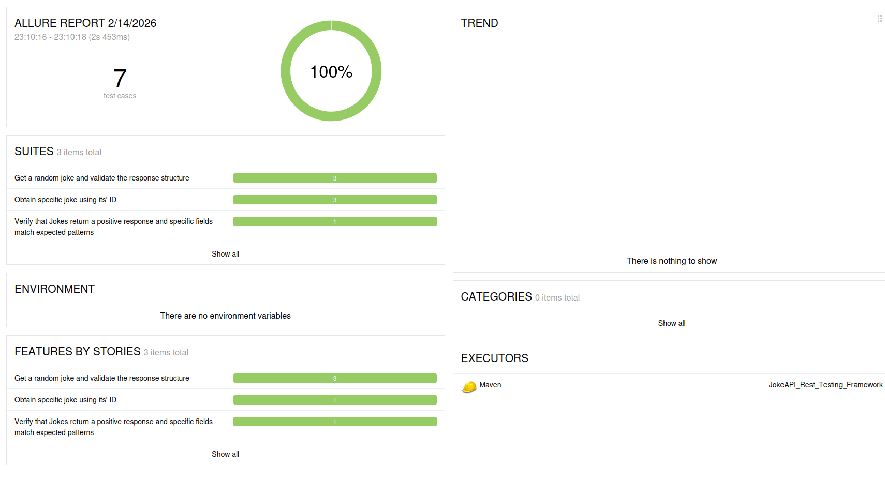

# README
## AI usage disclosure
To provide consistency and transparency in tracking AI supported development, all of the commits are beginning with tags
"_AI=NO_" or "_AI=YES_". Furthermore, all of the generated sections of the code will be marked with the following comment blocks:
```/* START AI */``` and ```/* END AI */```.
I am also providing a list of examples, where I utilized LLMs to support preparation of this project:
- ChatGPT was used to convert pom.xml file into Markdown list of used dependencies alongside their  versions
- During clients.JokeClient implementation I have inquired about transforming my first approach to a one utilizing Builder design pattern.
  Initial response has shown me how to handle the Path depending on Joke category and language, I have extrapolated that information
  to the rest of the possible combinations for the request.
- Creating a Step Definition implementation for Data Table scenario - LLM has created the method outline, I have only corrected the data access from singleJoke object

## Prerequisites
- Java Version 17 installed locally on the machine
- Maven build tool installed locally on the machine

## How to build the project?
First, make sure that the codebase is accessible on Your local machine, by cloning it from the Github repository:
```
git clone https://github.com/szywalam/JokeApiFramework.git
```
After doing so, go to the JokeApiFramework folder. Once You're there and prerequisites are met, the framework can be compiled
by executing the following command:
```
mvn clean install
```
This way, argument _clean_ will remove preexisting artifacts, if there are any, and _install_ will compile the project
and run all previous stages, including test.

Once compilation is done and tests are to be rerun, executing command ```mvn test``` should be sufficient, unless the
user wants to take precautions and prevent possible interference of created previously artifacts, then ```mvn clean test```
might be executed as well.

Compilation and test execution methods has been tested on two different devices: 
- personal computer with Linux Mint 22.1 Cinnamon (Kernel Version 6.8.0-88-generic) 
- Macbook Pro M4

## How to run certain tags within Feature files?
Using Maven and CLI, it is possible to run only certain tags, or exclude some of them from the Test Run. By default, it
is done using the following command:
```mvn test -Dcucumber.filter.tags="@TagName"```
In case where there is necessity to execute more than one tag, or all of them without a single tag, the following keywords
can be used within the cucumber.filter.tags property:
- and - Executes **only** scenarios containing all of the mentioned tasks
- or - Executes all scenarios containing either of the tags
- not - Excludes the scenarios marked by this tag 

Example from this framework could be:
```mvn test -Dcucumber.filter.tags="@SpecificJoke and not @BackgroundExample"```
which should run all scenarios containing @SpecificJoke tag, but only if they do not contain @BackgroundExample tag.

## Where can I find a test report?
Executing a Test Suite with Maven automatically generates a report within CLI that executed it. The project includes 
additional reporting tool, which is Allure Report. To generate a report from previous test execution, please run the
following command within the CLI:

```mvn allure:serve```

It will launch a local web server, which can be accessed by clicking on the address, while holding a Control button

Clicking on it, should lead to a similar looking page: 

To kill a process within Terminal which is currently hosting the test report, executing a ```CTRL + C``` shortcut should
be sufficient.
## Used tech stack 
- Java 17

**Dependencies**
- Cucumber Core - 7.31.0
- Cucumber Java - 7.31.0
- Cucumber TestNG - 7.31.0
- TestNG - 7.12.0
- Lombok - 1.18.42
- Rest Assured - 5.5.6
- Jackson Core - 2.20.1
- Jackson Databind - 2.20.0
- Jackson Annotations - 2.20
- Json - 20231013
- Allure TestNG - 2.25.0
- Allure Rest Assured - 2.32.0
- Allure Cucumber7 JVM - 2.32.0

**Plugins**
- Allure Maven - 2.10.0
